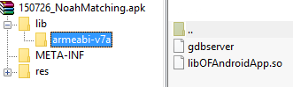
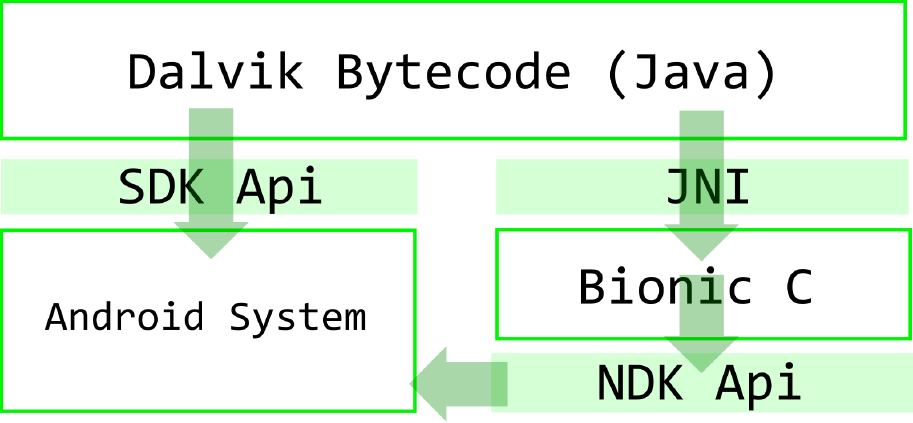
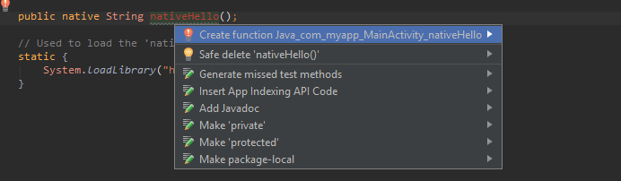

# JNI

## Introduction

Android applications and Java applications in general do not support platform specific features that may be needed by the application. Code written in Java is compiled into a bytecode that is executed in the context of JVM for Java applications and DalvikVM for Android applications.

But sometimes the developer may want to use libraries written in different language, such as C or C++. Moreover, for the entire set of requirements the usage of native code may be the only choice to get things done. And there takes place something that we call the JNI. 

JNI stands for *Java Native Interface*. In a nutshell, it is an interface that allows us to connect a native code with Java. Surprisingly, it isn't something that came with Android - JNI was released with Java 1.1 as a successor of the NMI (Native Method Invocation). It was originally created for ensuring binary compatibility for any Java Virtual machine on any platform.

Using the JNI, we can call Java methods from the native code and vice versa. Moreover, native code can load a Java class and request its descriptors. Reflection offers high amount of possibilities here.

## What is it good for

The main purpose of using native code is to overcome the limitations of Java such as memory management and performance. If done properly, C\++ can be compiled into more optimized machine-code than Java, especially for time-critical operations. This language is also very popular with game developers.

Additionally, applications that are powered by a game engine such as [Unity](http://unity3d.com) or [Atomic Game Engine](http://http://atomicgameengine.com/), are usually written in native code or some kind of a scripting language and the communication with upper layers provides the framework itself via JNI.

## JNI and NDK

In the case of pure Java, the only thing we need to call native code is the native code itself, the JNI header and a compiler. Unfortunately, in the case of Android, the situation is a bit trickier. Firstly, the operating system that Android is developed on is Linux-like. Secondly, there are more platforms to which the native code will be compiled. And finally, instead of C\++ standard library, Android has its own implementation, Bionic C, that is not fully compatible with the STD.

NDK stands for *Native Development Kit*. It is a complement to the SDK, a set of tools and build scripts that can be used to generate native binaries from C and C++ sources. It also contains a set of native system headers and libraries that will be supported in all future versions of Android. NDK can be used to create and manage native activities, handle user inputs, manipulate with a limited set of hardware sensors and much more.

The kit is available since *Android Cupcake* (1.5) and contains C libraries such as files, math, threads, timer, zlib and the Bionic C library.

## Example: From Java to native code

First of all, we are going to illustrate the steps required to write a simple application that invokes a C function. NDK nor Android are required for this example.

- create a Java class ```Hello``` that contains a declaration of a native method ```nativeHello```
- add a ```static``` initializer that will load a native library that will be created during next steps
- use ```javac``` to compile the class, resulting in a class file
- use ```javah -jni <fully-qualified-name>``` to generate a C header file that will contain the function prototype for the native method (```javah``` is a part of JDK). The command will look as follows: ```javah -jni myapp.Hello ```. Note that there must be a ```myApp``` directory that contains ```Hello.class``` file!
- write the C implementation of the native method
- compile the C source file, resulting either in a dll file, in the case of Windows, or in a so file, in the case of Linux (included header ```jni.h``` is also part of the JDK).
- execute the program and you will receive following output:

```
Hello from native code!
```

#### Java class (Hello.java):

```java
package myapp;

public class Hello {    
    public native String nativeHello();    

    static {
        System.loadLibrary("Hello");
    }        
    
    public static void main(String[] args) {
      System.out.println(new Hello().nativeHello());
    }
}

```


#### Native class (myapp_Hello.c):

```Cpp
#include <jni.h>
#include "myapp_Hello.h"


JNIEXPORT jstring JNICALL Java_myapp_Hello_nativeHello(JNIEnv *env, jobject obj){
	jstring ret = (*env)->NewStringUTF(env, "Hello from native code!");
    return ret;
}
```


When we look closely to the implementation of the native method, we will notice two parameters:
- ```JNIEnv``` is an interface pointer that allows manipulating the virtual machine. Declaration of its structure is located in the ```jni.h``` file
- ```jobject``` is a reference to the object itself
- ```jstring``` is a return type (each primitive has its own representative)
- ```Java_myapp_Hello_nativeHello``` is a function prototype of a method declared in Java code. It uses following syntax: ```Java_fully_qualified_name_method```

You realize that to return anything from native code to Java, we must use one of defined JNI types. The table below describes Java primitives and their equivalents. For complete set of all structures visit [this](http://docs.oracle.com/javase/7/docs/technotes/guides/jni/spec/types.html) page.


| Java type  | Native type             |
|--------------| ------------------|------------------|
|boolean   | jboolean             |
|byte   | jbyte             | 
|char   | jchar             | 
|short   | jchar             |
|int   | jint             |
|long   | jlong             | 
|float   | jfloat            |
|double   | jdouble             | 
|void  | void            |

Strings are represented by the ```jstring``` type that has nothing in common with ```char *```. The JNI uses UTF-8 strings and Java uses UTF-16.

## Example: from native code to Java

From the native code we can call any Java function - we use the magic ```JNIEnv``` pointer to do all the stuff. Following example shows how the communication may be achieved:

####Java class (Hello.java):

```java
package myapp;

public class Hello {    
    public String hello(){
      System.out.println("Hello from Java!");
    }    
}

```

#### Native class (Hello.cpp):

```Cpp
#include <jni.h>

void printHello()
{
  // initialized somewhere else (e.g. from previous request)
  JNIEnv *env = getEnv(); 
  // get class descriptor
  jclass helloClass = env->FindClass("myapp/Hello");
  // get constructor
  jmethodID constructor = env->GetMethodID(helloClass, "<init>", "()V");
  // create new object
  jobject helloInstance = env->NewObject(helloClass, constructor);
  // get hello method descriptor
  jmethodID helloMethod = env->GetMethodID(helloClass, "hello", "()V");
  // call hello
  env->CallVoidMethod(helloInstance, helloMethod);
}

```

We used the ```JNIEnv``` pointer to get a descriptor of the ```Hello``` class and then we created a new object and invoked its ```hello``` method.

The weird ```()V``` string actually describes the invoked method. It says that we are looking for a method with **no arguments** and a **void** return type. For complete set of descriptors, read [this](https://docs.oracle.com/javase/specs/jvms/se7/html/jvms-4.html#jvms-4.3.2) manual.

All Java objects returned by JNI are local references, therefore they are valid until the method is finished. To create a global reference, the ```JNIEnv``` provides  ```NewGlobalRef``` method.


## Android and NDK integration

For Android applications it is quite similar as for pure Java applications. All native libraries the resulting application contains are located under the ```libs``` folder. For each platform (x86, ARMv6, ARMv7) there is a subfolder that contains a binary file compiled for that platform.

<center></center>


The native code cooperates with the rest of the application as is shown in following figure:


<center></center>


## Installation

For several years the building process of native applications was such a pain. Usually, the Eclipse IDE with ADT plugin was used, then a compiler for Linux platform (Cygwin or MinGW), and of course, the NDK itself that put all these things together.

Fortunately, with *Android Studio* everything is much easier. In fact, it is a matter of a few steps:


- create a new empty project (don't enable the C++ support, it will create headers that we don't need)
- install NDK via SDK manager, if you  haven't done it yet
- check the latest version of the gradle experimental tool from  http://tools.android.com/tech-docs/new-build-system/gradle-experimental  
- replace the gradle plugin in the ```build.gradle``` script of the whole project as follows:

```gradle
classpath 'com.android.tools.build:gradle-experimental:0.7.3'
```

- rewrite the ```build.gradle``` script of the application as follows (don't forget to wrap the android module with the ```model``` element):

```gradle
apply plugin: 'com.android.model.application'

model {
    android {
        compileSdkVersion 24
        buildToolsVersion "24.0.1"
        defaultConfig {
            applicationId "com.myapp.hello"
            minSdkVersion.apiLevel 21
            targetSdkVersion.apiLevel 24
            versionCode 1
            versionName "1.0"
            testInstrumentationRunner "android.support.test.runner.AndroidJUnitRunner"
        }
        buildTypes {
            release {
                minifyEnabled false
                proguardFiles.add(file('proguard-android.txt'))
            }
        }
        ndk {
        }
    }
}
// dependencies keep as is

```

- try to synchronize and build the application
- add a new module into the ```ndk``` element
- if you want to access the Bionic C library, add a ```stl``` element  as follows. Then you will be able to include all headers from the standard library such as ```string```, ```vector```, ```stdio``` etc.

```gradle
        ndk {
          moduleName "hello-jni"
          stl "stlport_static"
        }
```


- the rest is very similar as in the first example - use a ```static``` initializer to load this library and create a declaration of a native method in the ```MainActivity.java``` file:

```Java
    public native String nativeHello();

    // Used to load the 'native-lib' library on application startup.
    static {
        System.loadLibrary("hello-jni");
    }
```

- since there is no prototype method for the native declaration yet, an error appears and you can use the popup menu to generate it:

<center></center>

- this will result in a ```hello-jni.c``` file:

```Cpp
#include <jni.h>

JNIEXPORT jstring JNICALL
Java_com_myapp_MainActivity_nativeHello(JNIEnv *env, jobject instance) {
    return (*env)->NewStringUTF(env, "Hello from native code!");
}
```

- the last step is to call the native method and display the string on the screen. Let's create a ```TextView``` and set its ```text``` property:

#### XML layout (activity_main.xml)

```xml
<?xml version="1.0" encoding="utf-8"?>
<RelativeLayout
    android:id="@+id/activity_main"
    xmlns:android="http://schemas.android.com/apk/res/android"
    android:layout_width="match_parent"
    android:layout_height="match_parent">

    <TextView
        android:id="@+id/txt_native"
        android:layout_width="wrap_content"
        android:layout_height="wrap_content"/>
</RelativeLayout>

```

#### Java code (MainActivity.java):

```Java
// ...
    @Override
    protected void onCreate(Bundle savedInstanceState) {
        super.onCreate(savedInstanceState);
        setContentView(R.layout.activity_main);
        TextView tv = (TextView) findViewById(R.id.txt_native);
        tv.setText(nativeHello());
    }
// ...
```

- if you have done everything properly, you should get this result:

<center></center>


### From C to C++
We have learnt on a simple example how to integrate a simple C code with Java. But what if we need to use C\++? By default, the generated header is written in pure C. To transform the code into C\++, you only have to do these two steps:

1. Rename the file extension to ```cpp```
2. Wrap the whole prototype with the ```extern "C"``` statement as follows:

```Cpp
#include <jni.h>

extern "C" {
  JNIEXPORT jstring JNICALL
  Java_com_myapp_MainActivity_nativeHello(JNIEnv *env, jobject instance) {
      // write any C++ code here
      return env->NewStringUTF(env, "Hello from native code!");
  }
}
```

## NDK limitations

Although the native development offers many possibilities, there are some limitations the developers must face:

- Android application framework layer that manage all basic functions (window allocation, lifecycle etc.) is majorly written in Java. Access to these functions from native code is strongly limited. Fortunately, you can implement your own bridge that will provide everything you need in your code. 
- NDK doesn't contain some popular C++ libraries such as the ```Boost``` library. This can cause problems especially when importing a third-party library that uses it.
- Calling the Java code from the native code is slow, as you may deduce from the first example, because references to Java methods are requested by their names. This issue, however, can be simply solved by creating a native member for each Java method that will keep a reference to it. Those members would be initialized only once.


# More references & resources

1. Android JNI documentation: http://docs.oracle.com/javase/7/docs/technotes/guides/jni/spec/types.html
2. Android NDK site:  http://developer.android.com/tools/sdk/ndk/index.html
3. Android NDK examples: https://developer.android.com/ndk/samples/index.html